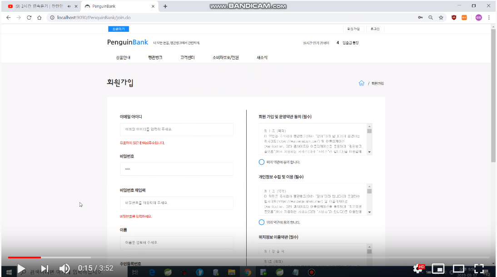
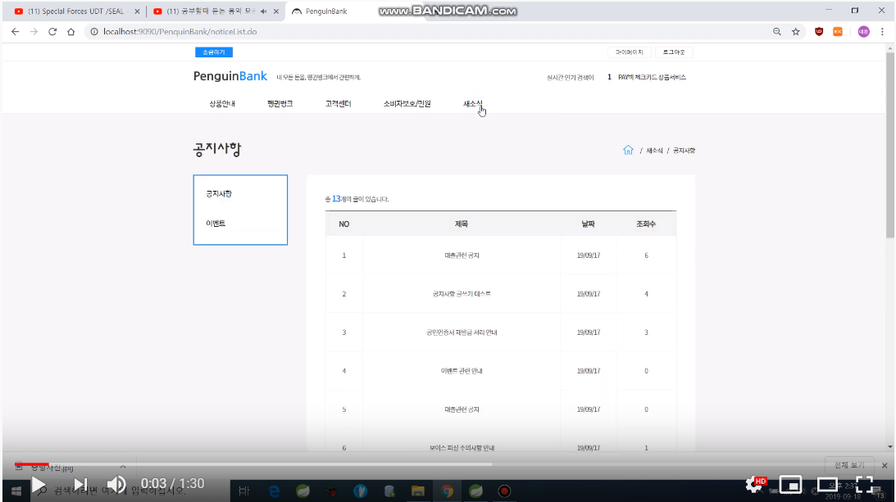

# PenquinBank
——————
## 1. 목차
```
.PenquinBank
├── 1.목차
├── 2.개요
├── 3.사용법
|   ├── 3.1.환경 세팅
|   ├── 3.2.실행 방법
|   └── 3.3.참고
├── 4.실행 영상
|   ├── 4.1.실행 영상(1/2)
|   ├── 4.2.실행 영상(2/2)
└── …
```


## 2. 개요
 - 은행 웹사이트로서 사용자는 송금 및 조회 업무를 볼 수 있다.

## 3. 사용법
### 3.1. 환경 세팅
- OS : Windows 10
- DB : Oracle 11g
- Language : Java 8, Servlet, JSP, JavaScript, jQuery, HTML5, CSS3.0, JSTL, Ajax
- ORM Framework : MyBatis 3.5
- Server : Apache Tomcat 8.5


### 3.2. 실행 방법
```
1. 설정관련.pptx 참고(경로에 포함되어 있음)
2. 주소란에 (ip 혹은 localhost):해당포트/PenquinBank/main.do로 들어가서 테스트
(예 : http://localhost:9090/PenquinBank/main.do)
```
### 3.3. 참고


## 4. 실행 영상
### 4.1. 실행 영상(1/2)
 [](https://www.youtube.com/watch?v=1qMqCYudnPQ)
 ### 4.2. 실행 영상(2/2)
[](https://www.youtube.com/watch?v=iL35ZAxQMJM)
